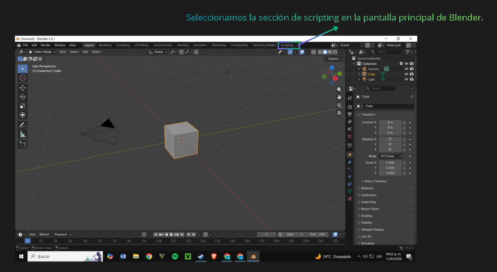
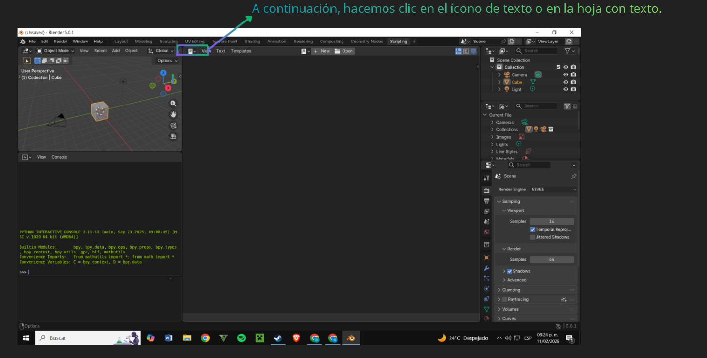
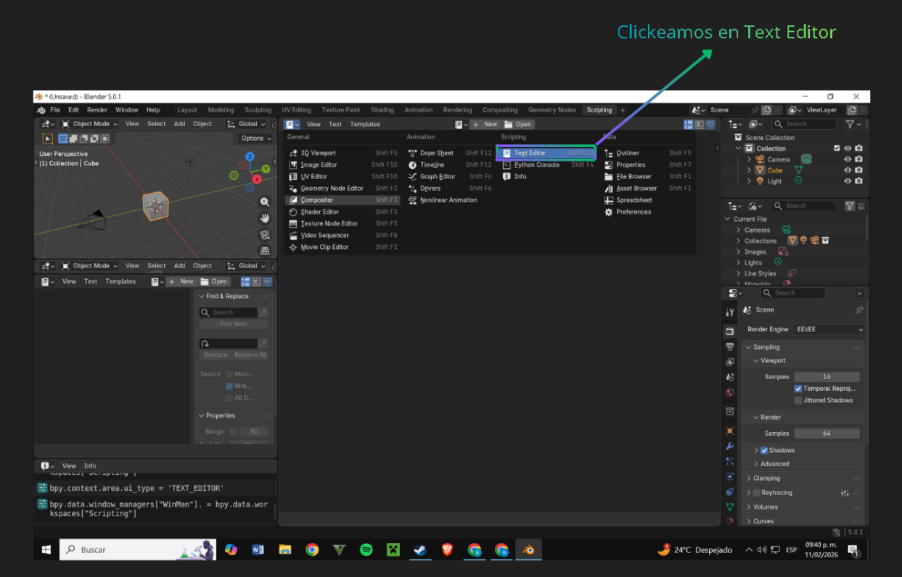
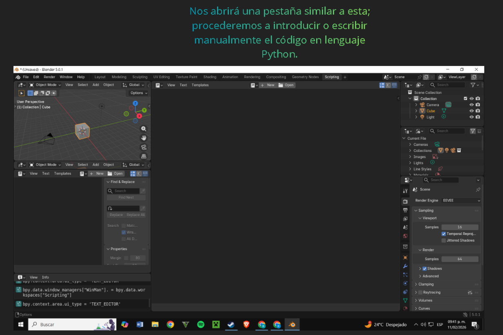
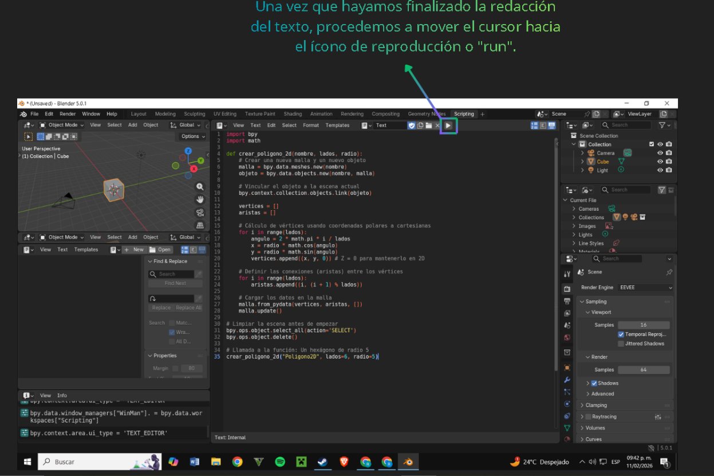
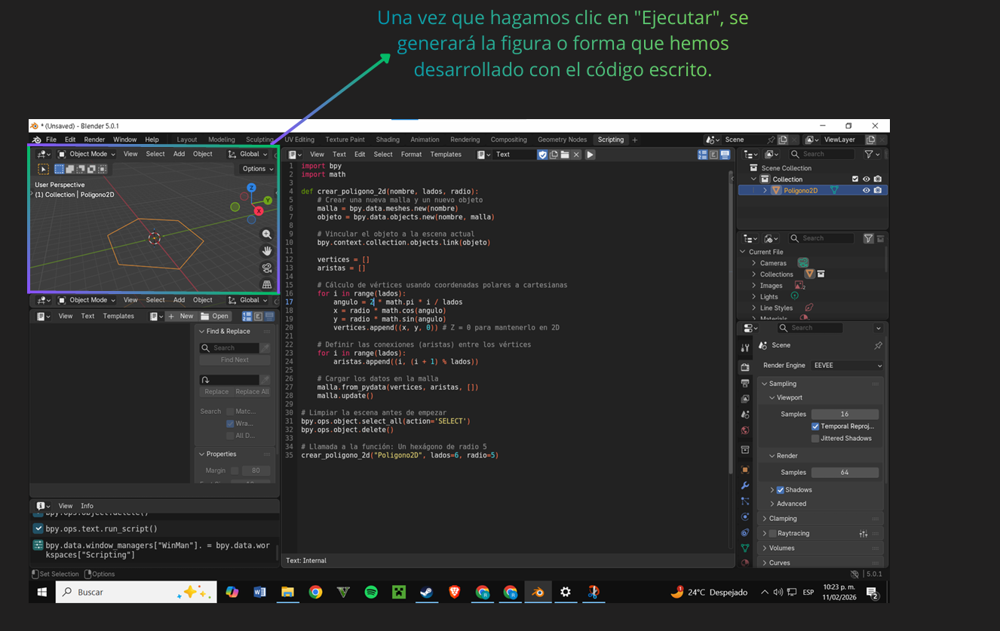
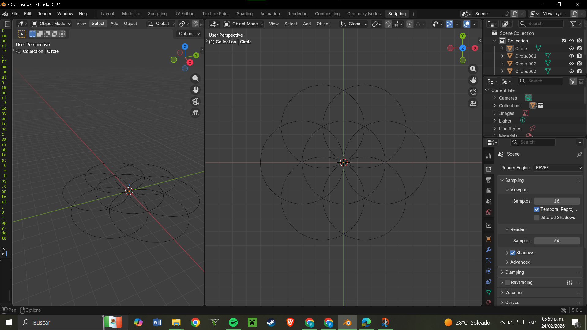

# Graficacion-Rodrigo-Cera.-O
# 1.5. Representación y trazo de líneas y polígonos.




## Codigo listo para copiar
```
import bpy
import math

def crear_poligono_2d(nombre, lados, radio):
    # Crear una nueva malla y un nuevo objeto
    malla = bpy.data.meshes.new(nombre)
    objeto = bpy.data.objects.new(nombre, malla)
    
    # Vincular el objeto a la escena actual
    bpy.context.collection.objects.link(objeto)
    
    vertices = []
    aristas = []
    
    # Cálculo de vértices usando coordenadas polares a cartesianas
    for i in range(lados):
        angulo = 2 * math.pi * i / lados
        x = radio * math.cos(angulo)
        y = radio * math.sin(angulo)
        vertices.append((x, y, 0)) # Z = 0 para mantenerlo en 2D
        
    # Definir las conexiones (aristas) entre los vértices
    for i in range(lados):
        aristas.append((i, (i + 1) % lados))
        
    # Cargar los datos en la malla
    malla.from_pydata(vertices, aristas, [])
    malla.update()

# Limpiar la escena antes de empezar
bpy.ops.object.select_all(action='SELECT')
bpy.ops.object.delete()

# Llamada a la función: Un hexágono de radio 5
crear_poligono_2d("Poligono2D", lados=6, radio=5)
```



# Práctica 1: Geometría Generativa con Python en Blender
 Esta práctica demuestra cómo utilizar la programación para crear geometría compleja basada en patrones matemáticos. En este caso, desarrollamos la figura de la "Flor de la Vida" automatizando la creación de círculos periféricos alrededor de un origen. 
La Base MatemáticaPara posicionar los círculos, no utilizamos coordenadas cartesianas x, y  directamente, sino coordenadas polares (sen,cos y angulo). 
Para que Blender pueda procesarlas, el script realiza la siguiente conversión: x = r * cos(angulo), y = r * sen(angulo). Donde r es el radio y lo de dentro de parentésis es el ángulo en radianes. Como el círculo completo tiene 360°, utilizamos math.radians() para convertir los grados a un formato que Python pueda interpretar.
### El siguiente código incluye la configuración del entorno, la creación del círculo central y el ciclo while solicitado.
```
import bpy
import math

# 1. Configuración del entorno: Limpiar la escena
# Selecciona todos los objetos y los elimina para evitar encimarlos [cite: 18, 26, 28]
bpy.ops.object.select_all(action='SELECT')
bpy.ops.object.delete()

# 2. Definición de variables [cite: 19, 30]
radio = 3  # Distancia desde el origen [cite: 31]
angulo_actual = 0  # Punto de partida en grados [cite: 32]
paso_angular = 60  # Paso de 60° para obtener 6 círculos uniformes [cite: 15, 33]

# 3. Trazado del origen: Círculo Central
# Se crea la primitiva en el centro exacto de la escena (0,0,0) [cite: 20, 35, 36]
bpy.ops.mesh.primitive_circle_add(radius=radio, location=(0, 0, 0), vertices=64)

# 4. Ciclo WHILE para completar el patrón (El Reto)
# Se ejecuta mientras el ángulo actual sea menor a 360 grados [cite: 94, 95]
while angulo_actual < 360:
    # Calcular la nueva posición (x, y) usando el ángulo actual [cite: 96]
    x = radio * math.cos(math.radians(angulo_actual))
    y = radio * math.sin(math.radians(angulo_actual))
    
    # Llamar a la función de Blender para añadir el círculo en la nueva ubicación [cite: 97]
    bpy.ops.mesh.primitive_circle_add(radius=radio, location=(x, y, 0), vertices=64)
    
    # Actualización de estado: Incrementar el ángulo actual [cite: 99]
    # Sumamos el paso (60°) en cada vuelta para evitar un bucle infinito [cite: 99, 100]
    angulo_actual += paso_angular

print("Patrón generado exitosamente.")
```
## Una vez escrito el codigo en blender pasamos a darle a run script, con esto nos generará la siguiente figura("Flor de vida").

# Practica 2 Construcción Procedural de un Escenario 3D
Esta práctica se enfoca en la implementación de transformaciones tridimensionales (traslación y escalamiento) y modelos de color mediante scripting en Blender. El objetivo es automatizar la creación de un pasillo arquitectónico con iluminación y materiales dinámicos. Se busca que el alumno comprenda la importancia de la automatización en la creación de activos 3D y la gestión eficiente de la memoria en entornos de ejecución.

### Fundamentos Técnicos
1. Gestión de Memoria y Entorno
En el desarrollo de scripts para software 3D, es una práctica estándar asegurar que el entorno de ejecución esté libre de residuos de ejecuciones previas. Esto se logra mediante una limpieza de la base de datos de objetos (bpy.data.objects), lo cual optimiza el rendimiento y previene el solapamiento de mallas.
```
bpy.ops.object.select_all(action='SELECT')
bpy.ops.object.delete()
```

3. Arquitectura de Materiales y Modelo RGB
Para evitar la redundancia de código y fomentar el paradigma de programación funcional, se implementa una función constructora de materiales. Esta utiliza el modelo RGBA, donde se definen los canales Rojo, Verde y Azul con valores normalizados entre 0.0 y 1.0, además de un canal Alpha para la opacidad.
4. Transformaciones Espaciales
Traslación: Se utiliza para posicionar los elementos en el espacio euclidiano. La posición de cada bloque se calcula dinámicamente en función del índice de iteración para generar una estructura simétrica.
Escalamiento: Se aplica de forma condicional para introducir variabilidad visual en el eje Z, alterando la altura de los polígonos según la lógica de control del script.

A continuación se presenta el código que resuelve la construcción del escenario:
```
import bpy

# 1. Limpieza del Entorno
# Seleccionamos y borramos todos los objetos para evitar duplicados en memoria
bpy.ops.object.select_all(action='SELECT')
bpy.ops.object.delete()

# 2. Definición de Materiales (Modelos de Color RGB)
def crear_material(nombre, r, g, b):
    # Creamos un nuevo material en la base de datos de Blender [cite: 130]
    mat = bpy.data.materials.new(name=nombre)
    # Definimos el color difuso usando el modelo RGBA [cite: 132]
    mat.diffuse_color = (r, g, b, 1.0)
    return mat

# Definimos los colores para nuestro escenario
mat_base = crear_material("GrisOscuro", 0.1, 0.1, 0.1)
mat_acento = crear_material("Neon", 0.0, 0.8, 1.0) # Un azul cian [cite: 136]

# 3. Parámetros del Escenario
largo = 10  # Cantidad de bloques [cite: 140]
ancho_pasillo = 3 # Distancia desde el centro

# 4. Construcción Procedural con Ciclos (Transformaciones)
for i in range(largo):
    # --- Pared Izquierda ---
    # Traslación: colocamos el cubo en x=-3, y=i*2, z=1 [cite: 144]
    bpy.ops.mesh.primitive_cube_add(location=(-ancho_pasillo, i * 2, 1))
    bloque_izq = bpy.context.active_object
    
    # Lógica de color: alternar materiales según el índice (Tema 4.1) 
    if i % 2 == 0:
        bloque_izq.data.materials.append(mat_base)
    else:
        bloque_izq.data.materials.append(mat_acento)
        # Escalamiento (Tema 3.3.2): mayor altura para bloques de acento 
        bloque_izq.scale.z = 1.5

    # --- Pared Derecha (Simetría) ---
    bpy.ops.mesh.primitive_cube_add(location=(ancho_pasillo, i * 2, 1))
    bloque_der = bpy.context.active_object
    bloque_der.data.materials.append(mat_base)

# 5. Suelo (Escalamiento y Posicionamiento)
# Creamos un plano y lo escalamos para cubrir todo el pasillo [cite: 162]
bpy.ops.mesh.primitive_plane_add(location=(0, largo - 1, 0))
suelo = bpy.context.active_object
suelo.scale.x = 4 [cite: 165]
suelo.scale.y = largo + 2 [cite: 166]

# 6. Iluminación Básica (Tema 4.2)
# Agregamos una luz de tipo "Point" para iluminar el recorrido [cite: 170]
bpy.ops.object.light_add(type='POINT', location=(0, largo, 5))
luz = bpy.context.active_object
luz.data.energy = 1000 # Intensidad de la luz [cite: 173]

print("Escenario generado exitosamente.")
```
Al presionar run scripting, nos generará el siguiente escenario en la vista de Blender 

