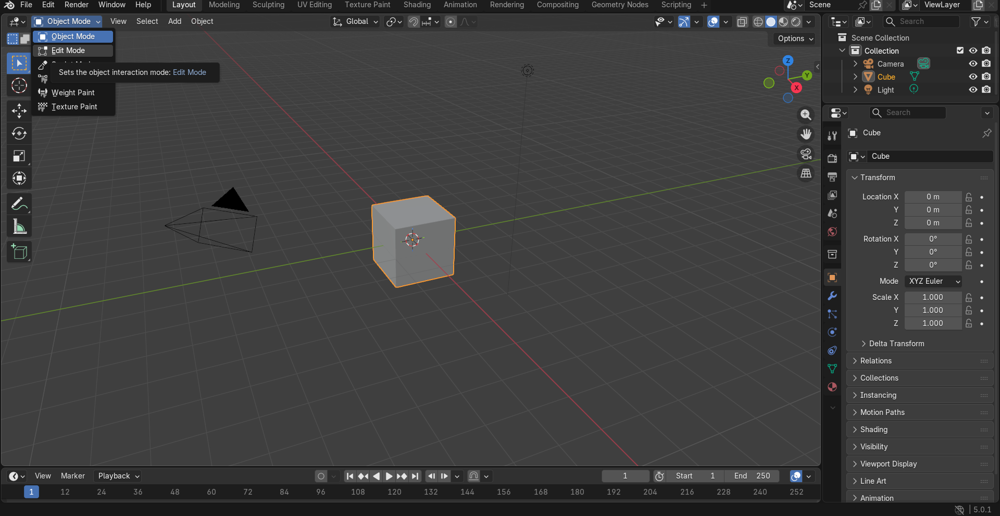
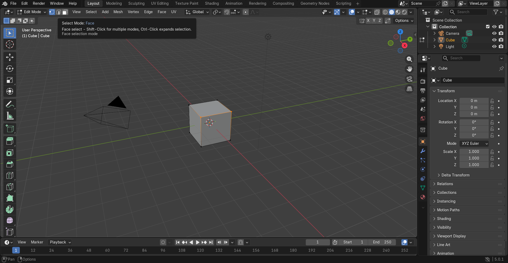
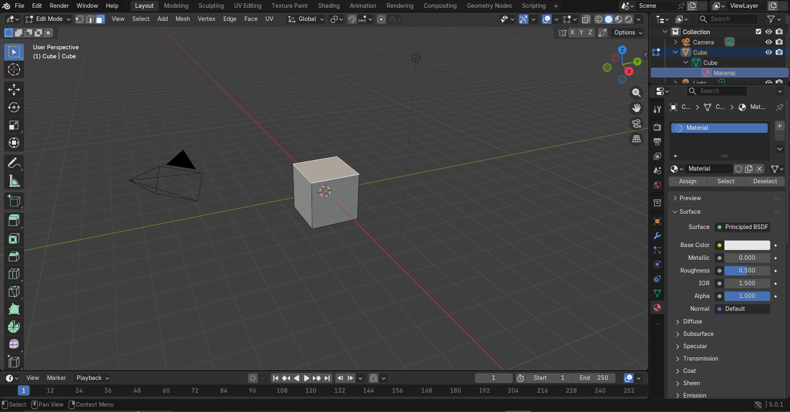
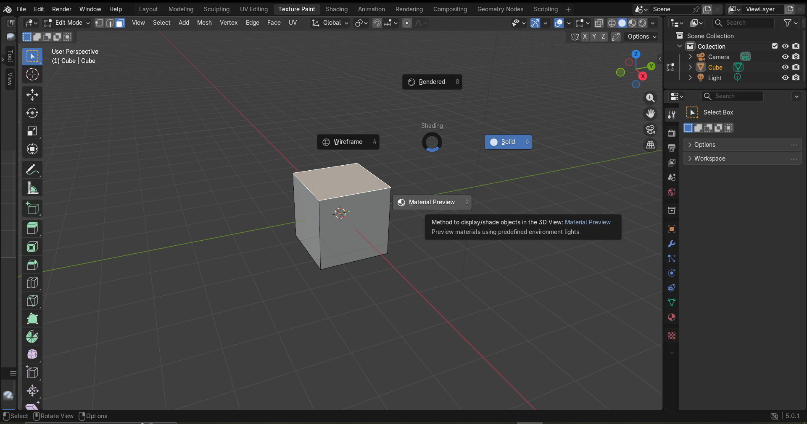
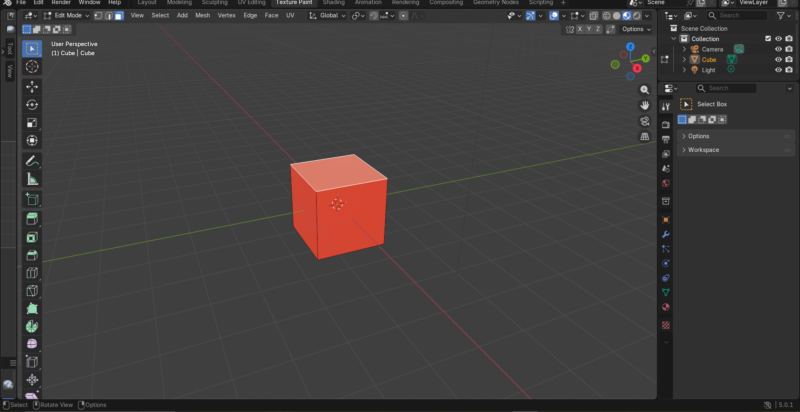

# Unidad I. Introducción a la graficación por computadora
### 1.1. Historia y evolución de la graficación por computadora
Introducción
El uso adecuado y provechoso de la tecnología ha transformado a la computadora en un dispositivo extremadamente poderoso para producir imágenes de forma rápida, económica y con un nivel de detalle sin precedentes. Actualmente, la graficación por computadora es una disciplina transversal; es decir, es posible aplicarla en prácticamente todas las áreas del conocimiento con objetivos específicos. 

De manera rutinaria, las gráficas generadas por ordenador son fundamentales en disciplinas como la ciencia y la ingeniería (para simulaciones y modelado), en el sector empresarial e industrial (diseño asistido por computadora), en el gobierno, la educación y la capacitación (simuladores de vuelo, material didáctico interactivo), así como en el arte, el entretenimiento (videojuegos, cine) y la publicidad.

Graficación por Computadora vs. Procesamiento de Imágenes
Es crucial establecer una distinción fundamental: aunque los métodos utilizados en la graficación por computadora y en el procesamiento de imágenes comparten bases matemáticas y características similares, no son lo mismo. Ambas áreas realizan operaciones fundamentalmente distintas:

Graficación por Computadora (Síntesis de imágenes): Utiliza herramientas de software y hardware para crear una o más imágenes desde cero, partiendo de modelos matemáticos, datos geométricos o algoritmos.

Procesamiento de Imágenes (Análisis y manipulación): Aplica técnicas algorítmicas para modificar, mejorar o interpretar imágenes ya existentes en el mundo real (como fotografías digitales, imágenes médicas o rastreos de televisión).  

El interés por los métodos de tratamiento digital de imágenes deriva de dos necesidades principales:

Mejora de la información: Optimizar una imagen para facilitar la interpretación visual humana (por ejemplo, mejorar el contraste de una radiografía).

Percepción autónoma: Procesar los datos de una escena para que una máquina o inteligencia artificial pueda "ver" e interpretar su entorno (Visión por Computadora).

Para aplicar estos métodos de procesamiento, el primer paso indispensable es la digitalización, que consiste en convertir una fotografía analógica o una señal visual en un archivo de imagen digital compuesto por píxeles.

Los Primeros Pasos: La Década de 1920
Los cimientos del manejo digital de imágenes se remontan mucho antes de la invención de las computadoras modernas. Una de las aplicaciones iniciales ocurrió a principios de la década de 1920, con el sistema de transmisión de imágenes por cable submarino de Bartlane. Este sistema se utilizó para enviar fotografías digitalizadas de periódicos entre Londres y Nueva York. Un equipo especializado de impresión codificaba la imagen en una cinta perforada para su transmisión a través del telégrafo, y luego un equipo receptor la reconstruía y la imprimía en el otro extremo, reduciendo el tiempo de envío de una foto a través del Atlántico de más de una semana a menos de tres horas.

Evolución de la Graficación por Computadora
A partir de la invención de los equipos de cómputo, la graficación evolucionó rápidamente:

Años 1950 (Los orígenes): Las computadoras como la Whirlwind del MIT introdujeron los primeros tubos de rayos catódicos (CRT) para visualización. El sistema de defensa SAGE de EE. UU. fue pionero en el uso de "lápices ópticos" (light pens) para que los operadores interactuaran gráficamente con la pantalla.

Años 1960 (El nacimiento de la interactividad): En 1963, Ivan Sutherland desarrolló Sketchpad, el primer sistema de diseño gráfico interactivo que permitía dibujar directamente en la pantalla. Este evento es considerado el verdadero nacimiento de la graficación por computadora moderna. En esta década también surgieron los primeros algoritmos de trazado de líneas y el concepto de gráficos vectoriales.

Años 1970 (Gráficos Rasterizados y 3D): La industria transitó de los gráficos vectoriales a los gráficos rasterizados (basados en píxeles). Surgieron los primeros modelos matemáticos para representar superficies tridimensionales, luces, sombras y el manejo de superficies ocultas (como el algoritmo Z-buffer de Edwin Catmull).

Años 1980 y 1990 (Fotorrealismo y CGI): La llegada de las computadoras personales y las primeras Tarjetas Gráficas o GPUs revolucionaron la accesibilidad. La técnica del Ray Tracing (trazado de rayos) comenzó a popularizarse para generar reflejos y refracciones realistas. El cine vio un auge con películas como Tron y más tarde Toy Story, demostrando el poder comercial de la animación 3D.

Siglo XXI al Presente (Renderizado en tiempo real): La potencia de las tarjetas gráficas (GPU) ha permitido el fotorrealismo en tiempo real, impulsando la industria de los videojuegos, la Realidad Virtual (VR) y la Realidad Aumentada (AR). Hoy en día, la graficación se integra con la inteligencia artificial para generar y optimizar imágenes a velocidades y calidades antes inimaginables.

# 1.2. Áreas de aplicación de la graficación por computadora
Introducción: El mundo a través de una ventana
La graficación por computadora (GC) es un campo eminentemente multidisciplinario. En él convergen computólogos, matemáticos, físicos, ingenieros, artistas digitales y diseñadores con un objetivo común: "mostrar un mundo a través de una ventana".

En esta analogía, el "mundo" puede ser un modelo digital abstracto, la simulación precisa de un fenómeno físico o cualquier representación visual imaginaria. La "ventana", por su parte, es el medio de despliegue: el monitor de una computadora, la pantalla de un teléfono inteligente, un proyector cinematográfico o incluso un visor de realidad inmersiva. Gracias al aumento exponencial en la capacidad de procesamiento gráfico (GPU), la GC ha permeado prácticamente todos los ámbitos de la actividad humana.

1.2.1. Aplicaciones por Sector e Industria
El impacto de la graficación varía según las necesidades de cada industria, facilitando procesos que antes eran costosos, lentos o directamente imposibles:

Industria del Entretenimiento: Es quizás la cara más visible de la GC. Abarca la creación de películas con imágenes generadas por computadora (CGI), caricaturas sintéticas, efectos visuales (VFX) que combinan metraje real con elementos digitales, publicidad y, por supuesto, la masiva industria de los videojuegos, donde motores gráficos renderizan mundos complejos en tiempo real.

Ingeniería Mecánica e Industrial: Utiliza sistemas CAD/CAM (Computer-Aided Design / Computer-Aided Manufacturing) para el diseño de prototipos virtuales. Esto permite a los ingenieros realizar pruebas de esfuerzo, simular colisiones y visualizar piezas con precisión micrométrica antes de su manufactura física (por ejemplo, mediante máquinas CNC o impresión 3D).

Arquitectura y Construcción:Va más allá de los simples planos en 2D. El software CAD y las metodologías BIM (Building Information Modeling) permiten crear visualizaciones fotorrealistas de espacios, realizar recorridos virtuales (fly-throughs) y simular la iluminación natural de un edificio en diferentes estaciones del año, todo antes de colocar un solo ladrillo.

Diseño de Producto: Fomenta la iteración rápida. Los diseñadores industriales pueden modelar ergonomía, texturas y colores, experimentando con cientos de variaciones de un producto en entornos virtuales, lo que reduce drásticamente el tiempo de salida al mercado.

Preservación del Patrimonio Cultural: La graficación permite la reconstrucción virtual de templos en ruinas, monumentos deteriorados o artefactos antiguos mediante técnicas como la fotogrametría. También permite crear simulaciones interactivas de escenas históricas para museos y educación.

Medicina y Ciencias de la Salud:  Vital para el diagnóstico y el entrenamiento. Las tomografías y resonancias magnéticas se reconstruyen en modelos 3D que los médicos pueden rotar y analizar. Además, las simulaciones hápticas permiten a los cirujanos practicar operaciones complejas en un entorno virtual sin riesgo para los pacientes.

1.2.2. Áreas de Especialización y Conceptos Técnicos
El desarrollo de todas estas aplicaciones se sostiene sobre pilares técnicos o áreas de especialización dentro de las ciencias computacionales:

Modelado 3D: Es la especificación matemática del mundo que se va a representar. Consiste en describir objetos y sus propiedades para que la computadora pueda procesarlos.  Por ejemplo, una manzana virtual se describe mediante un conjunto de vértices (puntos en el espacio 3D) que forman polígonos (caras), a los que se les asignan propiedades de textura y coeficientes que dictan cómo reaccionarán ante la luz.

Renderización (Rendering): Es el proceso algorítmico de generar una imagen 2D final a partir de la escena 3D (el modelo, las luces, las cámaras). Se divide principalmente en dos:

Real-time rendering: Genera imágenes al instante (al menos 30 a 60 cuadros por segundo), usado vitalmente en videojuegos y simulaciones interactivas.

Offline rendering: Dedica horas o días a procesar una sola imagen para lograr un fotorrealismo impecable mediante trazado de rayos (Ray Tracing), usado en cine y arquitectura.

Animación Computarizada: Crea la ilusión de movimiento secuenciando imágenes. No estudia la forma, sino el cambio en el tiempo: alteraciones en la posición (cinemática), color, forma (morphing) o iluminación de los modelos a lo largo de una línea de tiempo.

1.2.3. Tecnologías Derivadas y Emergentes
A medida que el hardware avanza, la graficación ha dado a luz a subdisciplinas altamente sofisticadas:

Simulación Científica y Gemelos Digitales: Ejecución de modelos matemáticos para replicar sistemas físicos. Desde el cálculo de la dinámica de fluidos (el movimiento de una ola o el aire sobre el ala de un avión) hasta simuladores de vuelo comerciales. Hoy en día evoluciona hacia los "gemelos digitales", réplicas virtuales exactas de fábricas o ciudades reales para probar su eficiencia en vivo.

Fotografía Computacional: La fusión de la óptica tradicional con la visión por computadora. Es lo que permite a las cámaras de los teléfonos móviles (equipos con lentes pequeños) lograr efectos de profundidad de campo (bokeh), HDR instantáneo, panorámicas perfectas y modo nocturno, compensando las limitaciones físicas del hardware con procesamiento gráfico puro.

Escaneo en 3D: La captura de la geometría del mundo real usando tecnologías como sensores LiDAR o luz estructurada para importar objetos o entornos completos a la computadora con exactitud milimétrica.

Procesamiento Digital de Imágenes: Técnicas para filtrar, mejorar, restaurar o extraer información de imágenes 2D ya existentes (por ejemplo, mejorar la nitidez de una foto de satélite o reconocer matrículas de autos).

Realidad Virtual (VR): Aísla al usuario del mundo físico para sumergirlo en un entorno 3D generado por computadora. Utiliza cascos estereoscópicos (HMDs), audio espacial y controladores de movimiento para engañar a los sentidos y crear una fuerte sensación de "presencia" en el mundo digital.

Realidad Aumentada (AR):  A diferencia de la VR, no aísla al usuario, sino que superpone (aumenta) información gráfica tridimensional generada por computadora sobre el mundo físico en tiempo real, utilizando dispositivos como gafas especiales o la cámara de un smartphone (como en filtros de redes sociales o aplicaciones de navegación).

## 1.3. Aspectos matemáticos de la graficación: Geometría FractalIntroducción a las bases matemáticasLa graficación por computadora se fundamenta profundamente en las matemáticas. 
Mientras que la geometría euclidiana y el álgebra lineal (mediante el uso de matrices y vectores) nos permiten representar y transformar formas regulares artificiales (como cubos, esferas o polígonos), estas herramientas resultan insuficientes para modelar la caótica complejidad del mundo real.

Para renderizar montañas, nubes, costas o la ramificación de los árboles, la graficación recurre a un área fascinante: la geometría fractal.¿Qué es un Fractal?Un fractal es un objeto geométrico cuya estructura básica, fragmentada o aparentemente irregular, se repite a diferentes escalas. 
A diferencia de las figuras geométricas tradicionales, los fractales inauguran un nuevo paradigma matemático que no distingue entre el conjunto matemático puro y el objeto natural, permitiendo a las computadoras simular formas orgánicas con una simetría compleja y desconcertante.

Propiedades Fundamentales de los Fractales

Para que un objeto generado por computadora sea considerado un fractal, debe cumplir con ciertas propiedades matemáticas:Autosimilitud: Es su característica más distintiva. Significa que el todo es exacta o aproximadamente similar a una de sus partes. Si hacemos un acercamiento (zoom) a un fractal, volveremos a ver la figura original repitiéndose una y otra vez de forma infinita. Esta autosimilitud puede ser exacta, cuasi-autosimilar o estadística (como en la naturaleza).Complejidad y detalle infinito: Tienen un número infinito de vértices o iteraciones. 
No importa cuánto nos acerquemos, la figura nunca pierde su nivel de detalle ni se reduce a una simple línea recta o curva euclidiana.Dimensión fractal (fraccionaria): A diferencia de un punto (dimensión 0), una línea (dimensión 1) o un plano (dimensión 2), los fractales ocupan un espacio intermedio. Su dimensión matemática es una fracción, lo que explica cómo una curva fractal puede arrugarse tanto que casi llena un plano bidimensional entero sin llegar a serlo.

La Matemática detrás de la Generación Fractal

En la graficación por computadora, los fractales no se dibujan a mano; se calculan. Se generan mediante algoritmos computacionales basados en la iteración o recursividad, es decir, tomando una fórmula matemática y alimentando el resultado de vuelta en la misma ecuación miles de veces.

El ejemplo más famoso es el Conjunto de Mandelbrot, el cual se define en el plano de los números complejos mediante la siguiente relación de recurrencia:

La computadora calcula esta ecuación para cada píxel de la pantalla, asignando colores dependiendo de qué tan rápido el resultado de la ecuación tiende al infinito.Aplicaciones de los Fractales en la GraficaciónLa incorporación de la geometría fractal revolucionó el diseño asistido y la industria del entretenimiento, inaugurando lo que se conoce como generación procedimental.
Sus aplicaciones incluyen:Generación de Terrenos y Paisajes: Utilizando algoritmos como el "desplazamiento de punto medio" o el ruido de Perlin (fractales estadísticos), los motores gráficos pueden generar montañas, valles y cordilleras realistas sin necesidad de que un artista modele cada roca.

Sistemas-L (Sistemas de Lindenmayer): Son gramáticas matemáticas recursivas utilizadas específicamente para simular el crecimiento de plantas, árboles y vasos sanguíneos de manera fotorrealista.Modelado de Fenómenos Naturales: Permite la creación visual de nubes, fuego, humo, galaxias y la simulación de texturas complejas (como la rugosidad de una corteza o la porosidad de una piedra).Compresión de Imágenes: Existen algoritmos de compresión fractal que buscan patrones autosimilares dentro de una fotografía para reducir drásticamente el tamaño del archivo de imagen sin perder demasiada calidad.

1.4. Modelos de color: RGB, CMY, HSV y HSLIntroducción: La necesidad de modelar el colorEn la graficación por computadora, el color no es solo una percepción visual, sino un dato matemático que debe ser almacenado, procesado y reproducido por hardware. Un modelo de color es un sistema abstracto que describe cómo los colores pueden ser representados mediante tuplas de números (generalmente tres o cuatro valores).Para entender los modelos de color, primero debemos dividirlos en dos grandes familias según su física subyacente: los modelos basados en la emisión de luz (aditivos) y los basados en la absorción de luz (sustractivos).

1.4.1. Modelo RGB (Aditivo)El modelo RGB (Red, Green, Blue - Rojo, Verde, Azul) es el pilar de la graficación por computadora. Es un modelo aditivo, lo que significa que el color se compone sumando diferentes intensidades de luz primaria sobre un fondo completamente oscuro (negro).Funcionamiento: Si la intensidad de los tres colores es 0, el resultado es el negro puro (ausencia de luz).
Si la intensidad de los tres colores está al máximo, la suma de las tres luces genera el blanco puro.Profundidad y Capacidad: En la computación estándar de 24 bits (8 bits por canal), cada color primario puede tener 256 niveles de intensidad (de 0 a 255). Esto permite $256 \times 256 \times 256$ combinaciones, lo que resulta en más de 16.7 millones de colores posibles. Frecuentemente, estos valores se representan en formato hexadecimal (ej. #FF0000 para rojo puro).Aplicaciones: Es el estándar universal para cualquier dispositivo que emita luz: monitores de computadora, pantallas de televisión, teléfonos móviles, proyectores y cámaras digitales. Todo el software de edición (como Photoshop) y el desarrollo web utilizan RGB como espacio de trabajo nativo para visualización en pantalla.

1.4.2. Modelo CMY / CMYK (Sustractivo)El modelo CMY (Cyan, Magenta, Yellow - Cian, Magenta, Amarillo) es la contraparte del RGB. Es un modelo sustractivo, diseñado no para emitir luz, sino para absorberla. Funciona sobre un sustrato blanco (como el papel) que refleja la luz ambiental.Funcionamiento: Las tintas actúan como filtros.El Cian absorbe (resta) la luz roja (+G +B, -R).El Magenta absorbe la luz verde (+R +B, -G).El Amarillo absorbe la luz azul (+R +G, -B).De CMY a CMYK: Teóricamente, mezclar cian, magenta y amarillo puros al 100% debería absorber toda la luz y dar como resultado un negro perfecto. En la práctica, las impurezas químicas de las tintas generan un tono marrón oscuro o barro. Por ello, la industria de la impresión añadió una cuarta tinta: el Negro (representado por la letra K, de Key o placa clave), creando el modelo CMYK para obtener negros profundos, mejorar el contraste y ahorrar tintas de color.Aplicaciones: Es el estándar absoluto para la industria de las artes gráficas y la impresión en soportes físicos (revistas, empaques, impresoras de inyección de tinta o láser).

1.4.3. Modelos Perceptuales: HSV y HSLMientras que RGB y CMYK son modelos orientados al hardware (pantallas e impresoras), resultan muy poco intuitivos para el ser humano. Si le pides a un artista que haga un "verde oliva más oscuro" usando valores numéricos de Rojo, Verde y Azul, le será muy difícil calcular la mezcla mentalmente.Para resolver esto, en la década de 1970 se crearon modelos basados en la percepción humana del color, que transforman el cubo matemático del RGB en cilindros o conos.Modelo HSV (Hue, Saturation, Value / Matiz, Saturación, Valor)También conocido como HSB (Brightness o Brillo), fue creado por Alvy Ray Smith en 1978. Se representa gráficamente como un cono invertido o un cilindro.Matiz (Hue - H): Es el tipo de color puro. Se representa como un ángulo de 0° a 360° en un círculo cromático.0° / 360° = Rojo.120° = Verde.240° = Azul.Los colores intermedios se encuentran entre estos grados (ej. Amarillo a 60°).Saturación (Saturation - S): Representa la "pureza" o intensidad del color frente a su desvanecimiento hacia el gris o el blanco. Se mide de 0% (gris/blanco) a 100% (color puro brillante). 

Es la distancia desde el centro del eje vertical hacia el borde exterior.Valor/Brillo (Value/Brightness - V): Representa la luminosidad. Se mide de 0% (negro absoluto, base del cono) a 100% (el máximo brillo que ese color puede alcanzar en su saturación actual).Modelo HSL (Hue, Saturation, Lightness / Matiz, Saturación, Luminosidad)También llamado HSI (Intensity). Es muy similar al HSV, pero su geometría se representa como un doble cono simétrico (bi-cono).El eje de Luminosidad (L): Va del 0% (Negro puro en el vértice inferior) al 100% (Blanco puro en el vértice superior). A diferencia del HSV, en el HSL, un color con Luminosidad al 100% siempre será blanco, sin importar el matiz o la saturación.

El ecuador (Luminosidad al 50%): Es aquí donde residen los colores puros y más vibrantes.Diferencia clave entre HSV y HSLAunque los selectores de color de los programas de diseño (como la famosa rueda cromática y el cuadro interior) a veces mezclan visualmente estos conceptos, matemáticamente reaccionan diferente:Para los artistas: HSL suele ser más intuitivo. Refleja la idea de que añadir "blanco" a un pigmento puro (desaturarlo hacia la luz) es diferente a añadirle "negro" (oscurecerlo).Comportamiento del blanco: En HSV, si tienes el Matiz en rojo (0°), la Saturación al 100% y el Valor (Brillo) al 100%, tienes un rojo puro. En HSL, si pones la Luminosidad al 100%, no importa el resto: tendrás blanco puro. Para tener rojo puro en HSL, necesitas la Luminosidad exactamente al 50%.Uso web: La especificación CSS3 adoptó HSL nativamente (color: hsl(0, 100%, 50%);) por su facilidad para crear paletas de color monocromáticas (simplemente variando el porcentaje de luminosidad sin alterar el matiz).

## Agregar material a un objeto en blender
# Asignación de Materiales a Caras Específicas de un Objeto en Blender

Este documento detalla el procedimiento estándar para aplicar un material específico a una sola cara de una malla tridimensional (en este caso, un cubo estandar) utilizando la interfaz de Blender.

## Requisitos Previos
* Tener un proyecto de Blender abierto con un objeto tridimensional (Malla/Mesh) en la escena.
* Tener al menos un material base creado en el panel de Propiedades de Material (`Material Properties`).

## Procedimiento Paso a Paso

### Paso 1: Transición al Modo de Edición (Edit Mode)
Para modificar la geometría interna o las caras individuales de un objeto, es necesario abandonar el modo de visualización general.
1. Seleccione el cubo en el espacio de trabajo (Viewport).
2. Diríjase a la esquina superior izquierda de la interfaz.
3. Haga clic en el menú desplegable que por defecto indica **Object Mode** y seleccione **Edit Mode**. Alternativamente, puede presionar la tecla `Tab` para alternar entre estos modos.

### Paso 2: Activación de la Selección de Caras (Face Select)
Por defecto, el Modo de Edición permite seleccionar vértices. Es necesario cambiar este comportamiento para interactuar con áreas completas.
1. En la parte superior izquierda, justo al lado del menú de modos, localizará tres iconos correspondientes a vértices, aristas y caras.
2. Haga clic en el tercer icono (**Face Select**), representado por un cuadrado con un punto en el centro. Alternativamente, presione el número `3` en el teclado alfanumérico.

### Paso 3: Selección de la Cara y Configuración del Material
1. En el área de trabajo tridimensional, haga clic izquierdo sobre la cara específica del cubo que desea modificar. La cara se resaltará en color naranja para confirmar la selección.
2. Diríjase al panel derecho de Propiedades y seleccione la pestaña **Material Properties** (icono de esfera roja).
3. Si desea un color diferente al resto del cubo, presione el botón `+` en la lista de materiales para agregar un nuevo *slot* (ranura de material) y luego haga clic en **New**.
4. Modifique el parámetro **Base Color** al tono deseado.
5. Con la cara aún seleccionada en el Viewport y el nuevo material resaltado en el panel, haga clic en el botón **Assign** ubicado debajo de la lista de materiales.

### Paso 4: Cambio al Modo de Previsualización de Materiales (Material Preview)
Si se encuentra en la vista de sombreado sólido (Solid), no podrá visualizar los colores renderizados.
1. Presione la tecla `Z` en su teclado para abrir el menú radial (Pie Menu) de opciones de sombreado del Viewport.
2. Seleccione la opción **Material Preview** (generalmente ubicada en la posición inferior del menú). También puede activarlo desde los cuatro iconos esféricos en la esquina superior derecha del Viewport.

### Paso 5: Verificación del Resultado
Al completar los pasos anteriores, la cara seleccionada mostrará el nuevo material asignado (ej. color rojo), diferenciándose del resto de la geometría del objeto, mientras mantiene una iluminación y previsualización de texturas en tiempo real.

# 1.5.1. Formatos de imagen y almacenamiento gráfico
Introducción: El reto del almacenamiento digital
En la graficación por computadora, una vez que una imagen ha sido sintetizada (renderizada) o capturada (mediante procesamiento de imágenes o escaneo), debe ser guardada en la memoria de la computadora. Dado que una imagen digital no es más que una enorme matriz de píxeles, almacenarla de manera "cruda" requiere una cantidad masiva de espacio.

Para solucionar esto, a lo largo de las décadas se han desarrollado múltiples formatos de archivo gráfico, cada uno diseñado para satisfacer necesidades específicas (impresión profesional, visualización web rápida, edición con capas, etc.).

Antes de analizar los formatos, es fundamental entender las dos características técnicas que los diferencian:

Profundidad de color (Color Depth): Es la cantidad de bits de información dedicados a cada píxel para representar su color. A mayor profundidad, más tonos distintos puede contener la imagen.

Ejemplo: 8 bits = 256 colores. 24 bits = 16.7 millones de colores (True Color). Algunas cámaras capturan a 48 o 64 bits para un rango dinámico extremo.

Compresión: Es el algoritmo matemático utilizado para reducir el peso del archivo. Se divide en dos categorías absolutas:

Compresión sin pérdidas (Lossless): El algoritmo compacta la información binaria, pero al abrir el archivo, la imagen se reconstruye píxel por píxel exactamente igual a la original. No hay degradación.

Compresión con pérdidas (Lossy): El algoritmo elimina información redundante o datos visuales que el ojo humano apenas percibe. Reduce drásticamente el tamaño del archivo, pero sacrifica calidad, generando "artefactos" o bloques borrosos si la compresión es muy alta.

Formatos principales en la industria
RAW (Formato crudo - El "negativo digital"):

Características: Consiste en la información pura y sin procesar que proviene directamente del sensor de una cámara digital.

Uso: Es la alternativa profesional al TIFF o JPEG en la fotografía. Los formatos RAW no son un estándar único (varían según el fabricante, como CR2 para Canon o NEF para Nikon).

Ventajas/Desventajas: Retiene el 100% de la información lumínica capturada, permitiendo corregir la exposición o el balance de blancos a posteriori sin perder calidad. Su principal inconveniente es que los archivos son sumamente pesados y requieren un software especial para "revelarlos" y exportarlos a un formato estándar antes de poder imprimirlos o publicarlos.

TIFF (Tagged Image File Format):

Características: Formato de almacenamiento de la más alta calidad, con compresión sin pérdidas (usualmente algoritmo LZW). Admite profundidades de color extremas de hasta 64 bits.

Uso: Es el estándar de oro para el escaneo de documentos de alta calidad, archivos médicos, fotografía profesional y programas de retoque digital que preparan archivos para imprenta.

Ventajas/Desventajas: Excelente fidelidad de imagen. El costo es su enorme peso en disco, lo que lo hace totalmente inviable para su uso en sitios web.

JPEG / JPG (Joint Photographic Experts Group):

Características: Es el rey indiscutible de la fotografía en Internet. Utiliza un algoritmo de compresión con pérdidas basado en la Transformada Discreta del Coseno (DCT).

Uso: Almacenamiento y transmisión web, cámaras digitales de consumo y redes sociales.

Ventajas/Desventajas: Permite al usuario decidir el nivel de compresión (ej. calidad del 1 al 100). Ahorra un espacio considerable frente a un TIFF, lo que agiliza la carga en redes. Sin embargo, no soporta transparencias y, si se comprime demasiado, la pérdida de calidad es evidente e irreversible.

GIF (Graphics Interchange Format):

Características: Utiliza compresión sin pérdidas, pero está severamente limitado por su profundidad de color de solo 8 bits (máximo 256 colores indexados).

Uso: Gráficos web simples, logotipos, memes y elementos de interfaz.

Ventajas/Desventajas: Su gran atractivo es que permite crear imágenes rodantes (animaciones fotograma a fotograma, conocidas como "GIFs animados") y soporta transparencia binaria (un píxel es 100% transparente o 100% opaco, sin puntos medios). Su baja calidad de color lo hace inútil para fotografías.

PNG (Portable Network Graphics):

Características: Concebido a mediados de los 90 como el sustituto moderno, libre y mejorado del GIF. Utiliza compresión sin pérdidas sumamente eficiente.

Uso: Gráficos web modernos, ilustraciones, capturas de pantalla y diseño UI/UX.

Ventajas/Desventajas: Incrementa la profundidad de color (hasta 48 bits, superando los 16.7 millones de colores). Su característica estrella es el Canal Alfa, que permite transparencias graduales (sombras suaves, bordes difuminados) que el GIF no puede lograr. Su archivo es más pesado que un JPEG.

PSD (Photoshop Document):

Características: Es un formato nativo y de trabajo, propiedad de Adobe.

Uso: Edición y retoque fotográfico profesional durante la etapa de producción.

Ventajas/Desventajas: Es el único formato que almacena el estado de edición completo: mantiene capas independientes, máscaras de recorte, textos editables, trazados vectoriales y filtros no destructivos. Conserva la calidad más alta posible, pero ocupa un espacio gigantesco en disco y no sirve para publicar en la web; debe exportarse a JPEG o PNG una vez terminado el diseño.

# 1.6. Procesamiento de mapas de bitsIntroducción: La naturaleza del Mapa de Bits (Raster)

En graficación por computadora, un mapa de bits (también conocido como imagen raster o rasterizada) es una estructura de datos que representa una rejilla rectangular de píxeles o puntos de color, que se puede visualizar en un monitor, papel u otro dispositivo de representación.A diferencia de los gráficos vectoriales (que usan fórmulas matemáticas para trazar líneas y formas escalables al infinito), un mapa de bits está anclado a una resolución específica. 

Si intentamos ampliar un mapa de bits más allá de su tamaño original, la computadora se ve obligada a inventar información que no existe, lo que resulta en el temido efecto de "pixelado" (los bloques de color se vuelven visibles).¿Qué es el Procesamiento de Mapas de Bits?El procesamiento consiste en aplicar algoritmos matemáticos a la matriz de píxeles para alterar la imagen original. 
Puesto que cada píxel tiene un valor numérico (basado en los modelos de color que vimos en el punto 1.4), procesar la imagen significa recalcular estos números.Las operaciones de procesamiento se dividen en tres grandes categorías técnicas:1. Operaciones Puntuales (Transformaciones de Píxel)Son las modificaciones más básicas. 

El algoritmo evalúa el valor numérico de un solo píxel a la vez y lo cambia por un nuevo valor, sin importar qué colores tengan los píxeles a su alrededor.Ajuste de Brillo y Contraste: Se suma o resta un valor constante a todos los píxeles (brillo) o se multiplica por un factor para separar los valores claros de los oscuros (contraste).Inversión (Negativo): Se resta el valor actual del píxel al valor máximo posible. Así, el blanco se vuelve negro y el rojo puro se vuelve cian.Binarización (Umbralización): Convierte una imagen en escala de grises a blanco y negro puro. Se define un valor umbral (ej. 128); cualquier píxel por debajo de 128 se vuelve 0 (negro) y cualquiera por encima se vuelve 255 (blanco).

Es vital en el reconocimiento óptico de caracteres (OCR).2. Operaciones Espaciales (Filtrado y Convolución)A diferencia de las operaciones puntuales, aquí el nuevo valor de un píxel depende de sus vecinos. Se utiliza una pequeña matriz numérica llamada Kernel o máscara de convolución (típicamente de 3x3 o 5x5 píxeles) que se desliza por toda la imagen, multiplicando los valores locales.Filtros de Suavizado (Blur): Promedian el valor de un píxel con el de sus vecinos.
Esto elimina el "ruido" de una fotografía o crea el efecto de desenfoque (como el famoso Desenfoque Gaussiano).Filtros de Realce (Sharpen): Aumentan el contraste entre píxeles adyacentes para hacer que una imagen borrosa se vea más nítida.Detección de Bordes: Algoritmos matemáticos (como los operadores Sobel o Canny) que buscan cambios bruscos de color o intensidad en la imagen, dibujando contornos. Es el primer paso para que una inteligencia artificial pueda identificar objetos. 

Operaciones Geométricas e InterpolaciónOcurren cuando necesitamos alterar la cuadrícula de la imagen, ya sea rotándola, sesgándola o cambiándola de tamaño (escalado). Como los píxeles son cuadrados rígidos en una cuadrícula fija, rotar una imagen 45 grados significa que los píxeles originales ya no encajan perfectamente en la nueva cuadrícula. 

Para solucionar esto, la computadora usa métodos de interpolación:Vecino más cercano (Nearest Neighbor): El método más rápido pero de menor calidad. Simplemente duplica o elimina píxeles. Genera bordes muy dentados.Interpolación Bilineal: Calcula el color del nuevo píxel promediando matemáticamente los 4 píxeles originales más cercanos.
Suaviza los bordes dentados, pero puede hacer que la imagen se vea un poco borrosa.Interpolación Bicúbica: Es el estándar en programas como Photoshop. Analiza los 16 píxeles circundantes y utiliza curvas matemáticas complejas para adivinar con gran precisión el color exacto que debería tener el nuevo píxel, manteniendo la nitidez de la imagen al cambiar su tamaño.
